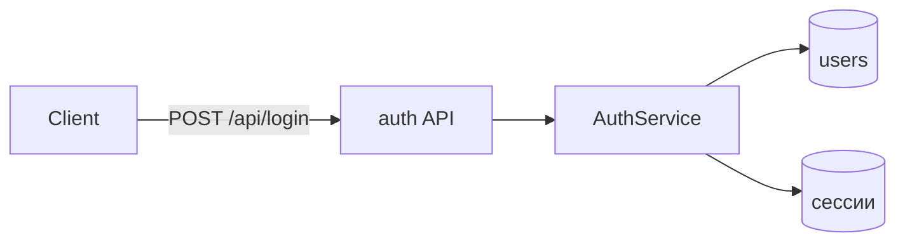

# Шаблон арх-документа

Файл: `docs/architecture/YYYY-MM-DD-<слаг>.md` — слаг тот же, что у файла плана.

Документ читают двое: агент, у которого нет ничего, кроме этого файла и плана, и человек, который вернётся сюда через полгода. Первому нужно знать, что строить и чего не делать. Второму — почему решили так, а не иначе.

Разделы ниже — ориентир, а не обязательная форма. Пустой раздел лучше убрать, чем заполнять словами «не применимо»: документ, наполовину состоящий из формальностей, перестают читать целиком. Но если раздел убран потому, что вопрос не выяснен, — ему место в открытых вопросах.

---

## Структура

```markdown
# Архитектура: <название>

- **Дата:** 2026-07-31
- **План:** `docs/plans/2026-07-31-user-auth.md`
- **Статус:** согласовано / черновик / пересмотрено 2026-08-14

Одно-два предложения: что за подсистема и какую задачу она решает.

## Контекст и ограничения

Что уже есть в проекте и с чем новое обязано ужиться. Ограничения, которые
сузили выбор: обратная совместимость, сроки, «этот модуль не трогаем»,
требования к нагрузке или безопасности, компетенции команды.

Здесь же — то, что было выяснено в диалоге и чего нет в коде: ожидаемые
объёмы, планы на будущее, известные боли текущего решения.

## Обзор решения

Как система устроена после изменений: из каких частей состоит, кто с кем
говорит, где проходят границы. Пять-семь предложений или схема.

Схему давай текстом или mermaid, если связей больше пяти — списком их уже
не удержать:



## Решения

По одному блоку на решение. Нумеруй `A1`, `A2`, … — на них ссылаются задачи плана.

### A1. Сессии в Redis, а не в JWT без состояния

- **Развилка:** чем удостоверять пользователя между запросами.
- **Решение:** серверные сессии в Redis, в куке — только идентификатор сессии.
- **Почему:** нужен мгновенный отзыв доступа при блокировке пользователя —
  это прямое требование из задачи. С JWT отзыв требует чёрного списка,
  то есть того же хранилища состояния, только с двойной логикой.
- **Отвергнуто:**
  - *JWT без состояния* — не даёт мгновенного отзыва; чёрный список
    возвращает состояние, ради отсутствия которого JWT и берут.
  - *Сессии в основной БД* — рабочий вариант, но добавляет запись в
    Postgres на каждый запрос; Redis в проекте уже есть.
- **Следствия:** Redis становится критичной зависимостью — при его
  недоступности вход невозможен (см. риски). TTL сессии 24 ч,
  продление при активности.
- **Обратимость:** средняя. Меняется формат куки и middleware, клиентский
  код не затрагивается.

### A2. …

## Контракты

Типы, схемы, сигнатуры и форматы, общие для нескольких задач, — то, по чему
параллельные исполнители обязаны сойтись. Пиши точно, но не пиши реализацию.

```ts
// src/types/auth.ts
type Session = {
  id: string          // uuid v4
  userId: string
  createdAt: string   // ISO 8601
  expiresAt: string   // ISO 8601
}
```

Формат ошибок, коды статусов, ключи в хранилище, имена событий — сюда же.

## Модель данных

Изменения схемы: таблицы, поля, индексы, инварианты. Порядок миграции и
отката, нужен ли бэкфил, работает ли старый код во время выкатки.

## Нефункциональные требования

Только измеримое и только то, что реально известно: ожидаемая нагрузка,
целевые времена ответа, объёмы данных, требования доступности,
требования к правам доступа и обработке чувствительных данных.
Неизвестное — в открытые вопросы, а не в выдуманное число.

## Границы: чего мы намеренно не делаем

Отвергнутые направления и отложенные возможности. Раздел спасает от
«улучшений», ломающих замысел: агент, увидев здесь «мульти-тенантность не
закладываем», не начнёт закладывать её на всякий случай.

## Риски

| Риск | Последствие | Что делаем |
|------|-------------|------------|
| Redis недоступен | Вход невозможен для всех | Алерт на доступность; деградация не предусмотрена — принято осознанно |

## Открытые вопросы и точки остановки

Что не выяснено, кто должен ответить, и где именно исполнителю следует
остановиться и спросить человека вместо того, чтобы решить самому.

- **Q1.** Нужен ли вход по SSO для корпоративных клиентов? Ответ меняет A1.
  До ответа схему `users` не расширяем.
```

---

## Как ссылаться на решения из плана

В задаче плана указывай конкретный якорь, а не документ целиком:

```markdown
- **Архитектура:** A1 (сессии в Redis) — `docs/architecture/2026-07-31-user-auth.md#a1`
```

Так исполнитель попадает сразу в нужный блок. Ссылка на файл целиком означает, что он либо прочитает всё, либо не прочитает ничего.

## Пересмотр решения

Принятое решение не переписывается молча — иначе документ перестаёт быть историей и становится просто текущим состоянием, которое ничем не лучше кода. Помечай:

```markdown
### A1. Сессии в Redis, а не в JWT без состояния

> **Пересмотрено 2026-08-14 → см. A7.** Требование мгновенного отзыва снято
> продуктом, а Redis оказался единственной причиной его держать.
```
